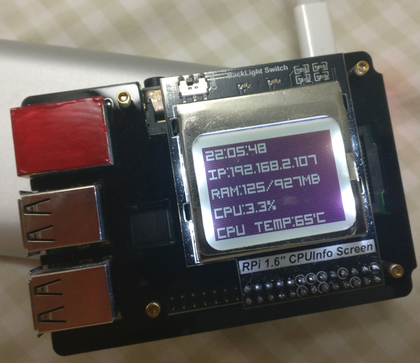

# sys status
Show system status of Raspberry Pi in a PCD8544 screen

## Usage
1. Edit `screen_config.ini` if needed
2. Kick off `sys_status.py`

## Other options
- Use `image_generate.py` to preview the image before sending to Raspberry Pi
- Adjust `sys_status.py` to get inverted color
